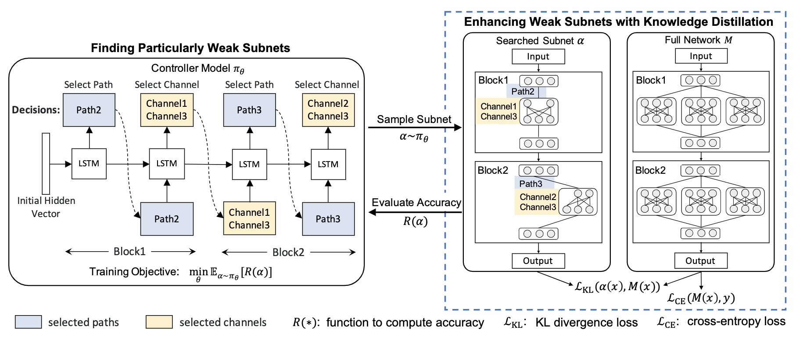

# [ECCV 2020] Improving Robustness by Enhancing Weak Subnets [[Paper]](https://arxiv.org/pdf/2003.07018.pdf)


Pytorch implementation for "Improving Robustness by Enhancing Weak Subnets".

<p align="center">

</p>


## Dependencies
```
Python>=3.7, PyTorch>=1.9.0, torchvision, numpy, pickle
```


## Testing

You can evaluate our models on CIFAR-10(-C), CIFAR-100(-C), and ImageNet(-C/P). <br />
We release our best [pre-trained models](https://drive.google.com/drive/folders/1wp6dcaAXbVJqx6Ohb3KVulkHS9JOa93m?usp=sharing) for each of the above datasets.

1. Download the original CIFAR-10, CIFAR-100, and [ImageNet](https://github.com/landskape-ai/imagenet) dataset.

2. Download the corrupted test sets, including CIFAR-10-C, CIFAR-100-C, and ImageNet-C dataset. Please refer to the detailed [instructions](https://github.com/hendrycks/robustness) to download them.

3. Run the testing script.

- CIFAR-10 & CIFAR-10-C

```bash
python train_cifar.py --dataset cifar10 --cifarc_base_path /path/to/CIFAR-10-C --checkpoint ./checkpoints/ews_cifar10_resnet50_augmix.pth --test_only
```

- CIFAR-100 & CIFAR-100-C
```bash
python train_cifar.py --dataset cifar100 --cifarc_base_path /path/to/CIFAR-100-C --checkpoint ./checkpoints/ews_cifar100_resnet50_augmix.pth --test_only
```

- ImageNet & ImageNet-C
```bash
python train_imnet.py --dataset imagenet --model_type resnet --ngpus 2 --layers 50 --data /path/to/imagenet --inc_path /path/to/imagenet-c --batch_size 64 --checkpoint ./checkpoints/ews_imagenet_resnet50_deepaug.pth --test_only
```

To evaluate the model on ImageNet-P, please refer to this [script](https://github.com/hendrycks/robustness/tree/master/ImageNet-P).


## Training

- CIFAR-10 (e.g., with AugMix)
```bash
python train_cifar.py --dataset cifar10 --ngpus 2 --augmix --use_checkpoint
```

- CIFAR-100 (e.g., with AugMix)
```bash
python train_cifar.py --dataset cifar100 --ngpus 2 --augmix --use_checkpoint
```

- ImageNet
```bash
python train_imnet.py --dataset imagenet --model_type resnet --ngpus 8 --data /path/to/imagenet
```


## Citation

If you use any part of this code in your research, please cite our paper:

```
@inproceedings{guo2022improving,
  title={Improving Robustness by Enhancing Weak Subnets},
  author={Guo, Yong and Stutz, David and Schiele, Bernt},
  booktitle={European conference on computer vision},
  year={2022},
  organization={Springer}
}
```

